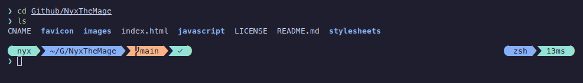

# Nyx's Theme for Oh My Posh

How I make my terminal look nice using Oh My Posh. I use the Catppuccin Mocha
theme for the KDE Plasma Desktop on Linux and this makes my terminal prompt
match. I include the full Catppuccin Mocha pallette in the TOML file to make it
easy to mix and match to taste.

# Requirements

- [Oh My Posh](https://github.com/jandedobbeleer/oh-my-posh)
- [Catppuccin](https://github.com/catppuccin/catppuccin)

# How to Use

- [Oh My Posh Customisation](https://ohmyposh.dev/docs/installation/customize)
