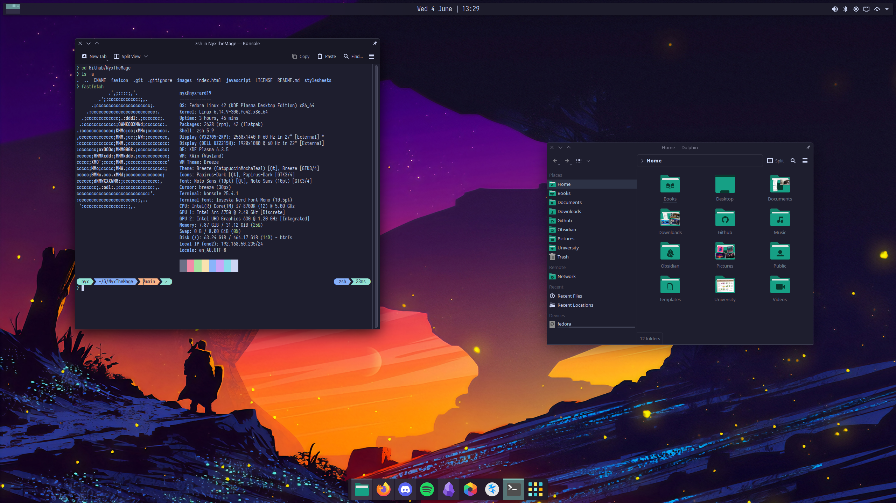

I like my mess of a desktop. Here will be where I keep the config.

# Overall Theme

- [Catppuccin](https://github.com/catppuccin/catppuccin)
- [Papirus Icons](https://github.com/PapirusDevelopmentTeam/papirus-icon-theme)
- [Papirus Folders](https://github.com/PapirusDevelopmentTeam/papirus-folders)

# KDE Plasma 6 Config

Config save: [nyxcat.knsv](nyxcat/conf.yaml)

- [Konsave](https://github.com/Prayag2/konsave)
- [KZones](https://github.com/gerritdevriese/kzones)

# Terminal

Oh My Posh theme: [nyxcat.omp.toml](nyxcat.omp.toml)

- [Z Shell](https://zsh.sourceforge.io/)
- [zsh-syntax-highlighting](https://github.com/zsh-users/zsh-syntax-highlighting)
- [zsh-autosuggestions](https://github.com/zsh-users/zsh-autosuggestions)
- [Oh My Posh](https://ohmyposh.dev/)

# Terminal Apps

- [btop](https://github.com/aristocratos/btop)
- [nvtop](https://github.com/Syllo/nvtop)
- [tmux](https://github.com/tmux/tmux)
- [pipx](https://github.com/pypa/pipx)
- [atuin](https://github.com/atuinsh/atuin)
- [rclone](https://github.com/rclone/rclone)
- [betterdiscordctl](https://github.com/bb010g/betterdiscordctl)
